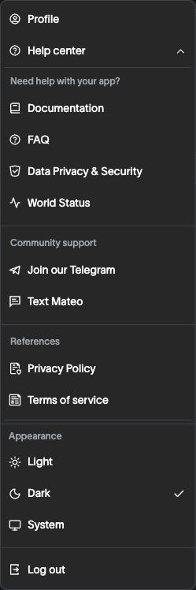
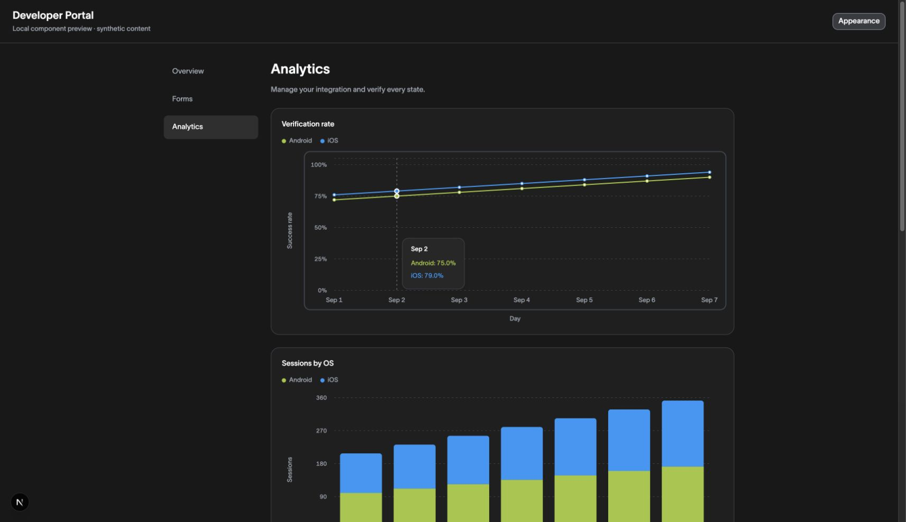

# Dark-mode QA — 2026-09-13

## Changes verified

- Profile and Help Center rows now share an 8px icon-to-label gap. Their old gaps differed (6px versus 12px).
- Account, Help Center and appearance rows share hover, keyboard-focus and open-state styling. The raised menu is `#272727`; highlighted rows are `#3c424b` with light foregrounds.
- Dark monochrome SVG assets use `currentColor` masks. Light assets and explicitly colored artwork, identity badges, images and status glyphs retain their intended colors.
- Mobile Help Center expands within the account menu instead of opening a submenu beyond the screen edge.
- Mobile verification fields can shrink within their grid/flex parents; previously the inner scrolling area silently clipped the right side.
- Shared primary/destructive actions, radio/switch/checkbox states, input focus/error states, skeletons, syntax highlighting, chart axes/tooltips and canvas colors have dark semantic treatments.

## Agent-run browser checks

Chrome, local server on port 3001 in the separate dark-mode worktree. Desktop widths included 1440px and 1728px; phone checks used 390 × 844. The original port-3000 checkout was not used for these fixes. Temporary viewport override was reset after QA.

| Surface                     | Checks performed                                                                                                                                                                                                     |
| --------------------------- | -------------------------------------------------------------------------------------------------------------------------------------------------------------------------------------------------------------------- |
| Shell and apps              | Navigation, app/team/account switchers, app cards and search, icon visibility, create-app dialog disabled/invalid/valid presentation; no app created                                                                 |
| Menus                       | Profile/Help label alignment; desktop submenu and keyboard navigation; mobile inline Help expansion/collapse; Light/Dark selection; visible hover/highlight states                                                   |
| Team settings               | General, members, API keys, MCP provider selection; invite/new-key dialogs opened and cancelled; no invitations or credentials created                                                                               |
| Profile                     | Light and dark layouts, mobile fit, team menu, new-team and delete-account dialogs opened/closed; no account/team/privacy data changed                                                                               |
| App configuration           | World ID configuration, Develop, all four verification steps, country menu, review state; no autosaved fields changed or registration submitted                                                                      |
| Mobile                      | Apps/cards, create-app dialog, profile, sidebar/account/Help menus, verification input bounds, shared forms and chart tooltip                                                                                        |
| Synthetic component preview | Selected radio and on/off switches, button variants, disabled/loading/invalid fields, sheet focus and close, populated line/bar/funnel/canvas charts, keyboard chart tooltip, empty chart, code and skeleton styling |

Computed-style text checks on the reviewed dark pages and preview states reported no failures after fixes. These checks cover visible DOM text and ancestor background compositing, not every image, gradient, canvas pixel, opacity combination or accessibility requirement. Document overflow checks were supplemented with screenshots because inner overflow can hide clipped controls.

## Automated checks

- `pnpm test:unit`: **145 suites, 900 tests passed** (unit, scripts, schema).
- `pnpm exec tsc --noEmit --incremental false`: passed.
- `pnpm lint`: passed (the repository script scopes ESLint to app/components/lib).
- `pnpm format:check`: passed.
- Added theme preference/rollout/storage tests, monochrome-versus-artwork icon tests, actual-token dark contrast tests, and menu spacing/highlight/mobile expansion tests. Real-provider DOM tests cover valid cross-tab changes, malformed/prototype-key values, preservation of unrelated root classes, and forced-light rollback. Updated existing primitive-class assertions to the new semantic classes without removing their behavior assertions.

## Limits and release follow-up

- User-reported follow-up, not yet resolved: white fragments near the top app-switcher area on screens where the app switcher is absent. Keep the PR in draft until reproduced, fixed and browser-verified.
- The supplied app is an unregistered external integration. Registered-RP dashboard/actions and Mini App-only notification/data flows were not fully browser-accessible. Synthetic charts validate shared rendering, not those entire workflows.
- Transactions rendered “Failed to load transactions.” Successful transaction data was not available for UI validation.
- No destructive confirmations, real saves, registrations, invitations, credential generation or privacy settings were submitted.
- No production build/deploy, production CSP/hydration validation, OS appearance change, cross-tab preference test or cross-browser pass is claimed. Theme storage sanitization and rollout branches have unit coverage.
- Some original light-mode muted text and colored avatar initials have low contrast. This change preserves the original light palette; it is not a full light-mode accessibility remediation.
- Production stays off unless explicitly enabled. Keep rollout internal until unavailable flows and production startup behavior are checked; explicit `PORTAL_DARK_MODE_ENABLED=false` is the rollback switch.

## Screenshots

The published screenshots use synthetic chart data or menu-only crops. Full account/profile and verification captures remain local and are intentionally excluded from the public PR.
